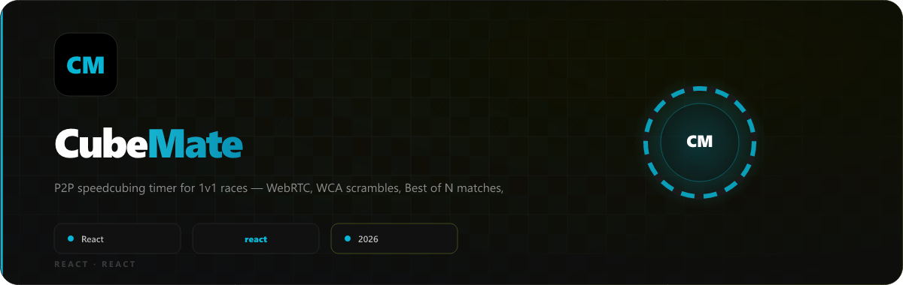

<p align="center">
  
</p>

---

## 🌐 Try It Live

<div align="center">

### **[→ cubemate-liart.vercel.app](https://cubemate-liart.vercel.app)**

Share a room code with a friend and start racing in seconds.

</div>

---

## ✨ Features

<table>
<tr>
<td width="50%">

### 🎥 P2P Video Rooms
WebRTC video + audio between cubers, peer-to-peer via WebTorrent DHT. No video ever touches a server.

### 🏆 Best-of-N Matches
Bo1 / Bo3 / Bo5 / Bo7 with live win pips, score tracking, and a celebration overlay when the match ends.

### 🌍 All 17 WCA Events
3x3, 2x2, 4x4, 5x5, 6x6, 7x7, 3BLD, 4BLD, 5BLD, 3x3 OH, FMC, Megaminx, Pyraminx, Skewb, Square-1, Clock, MBLD.

### 🎲 3D Scramble Viewer
Interactive `TwistyPlayer` from cubing.js renders every scramble in 3D.

</td>
<td width="50%">

### ⏱️ Stackmat-style Timer
Hold → release → solve. Optional 15-second WCA inspection with +2 / DNF auto-penalty, audio cues, and vibration.

### 📊 Session History
Solves grouped by session with Best / Ao5 / Ao12 / Mean. Export any selection as CSV or JSON.

### 📱 Mobile-First
Video feeds + timer on the same screen. Match score strip always visible above the tab bar.

### 🔒 Privacy First
Solve data lives in your browser only. The signaling server never sees your times.

</td>
</tr>
</table>

---

## ⌨️ Timer Flow

```
Hold Space ──► [READY — green glow] ──► Release ──► Inspection 15→0
                                                           │
                                                    Hold ──► Release ──► [RUNNING ⏱️]
                                                                               │
                                                                        Press Space ──► [STOPPED ✓]
```

| State | Display | Action |
|:---:|:---:|:---|
| **Idle** | `0.00` | Hold Spacebar |
| **Ready** | 🟢 green glow | Release → starts inspection |
| **Inspection** | `15 → 0` countdown | Hold → Release → starts solve |
| **Running** | live green timer | Press Space → stops |
| **Stopped** | final time | Press Space → new scramble |

---

## 🛠️ Tech Stack

| Layer | Technology |
|:---|:---|
| Framework | React 18, Vite, TypeScript |
| Styling | Tailwind CSS v3 |
| Routing | React Router v6 |
| P2P Transport | Trystero (WebTorrent DHT) |
| Signaling Fallback | Socket.IO (self-hosted) |
| Scrambles + 3D | cubing.js (WCA official) |
| Cloud Sync (optional) | Convex |
| Matchmaking Queue | Upstash Redis |
| Storage | localStorage + IndexedDB |
| Deployment | Vercel |

---

## 🚀 Getting Started

```bash
# Clone the repo
git clone https://github.com/peterish8/CubeMate.git
cd CubeMate

# Install dependencies
npm install

# Start the frontend (http://localhost:5173)
npm run dev

# Optional: start the signaling server (http://localhost:3001)
npm run server
```

Copy `.env.example` to `.env.local` and fill in your values if you want Convex cloud sync or Redis matchmaking.

```bash
cp .env.example .env.local
```

| Command | Description |
|:---|:---|
| `npm run dev` | Vite frontend dev server |
| `npm run server` | Socket.IO signaling server |
| `npm run build` | Production build → `dist/` |
| `npm run typecheck` | TypeScript type check only |
| `npm test` | Run vitest test suite |

---

## 📁 Project Structure

```
CubeMate/
├── src/
│   ├── app/              # Router, Convex shell, top-level providers
│   ├── domain/           # Pure logic: types, timer, stats, match, scramble
│   ├── features/         # Feature slices: room, timer, session, match, auth…
│   ├── persistence/      # localStorage + hybridRepository + Convex outbox
│   └── shared/           # Shared UI primitives (icons, badges, toggles)
├── server/
│   ├── index.ts          # Socket.IO signaling server
│   └── matchmaking/      # Memory + Redis matchmaking backends
├── convex/               # Convex backend (optional cloud sync)
├── docs/adr/             # Architecture Decision Records
└── vercel.json           # Vercel deployment config
```

---

## 🔄 Sync Protocol

Timer events are broadcast as typed `SyncMessage` objects over Trystero's data channel — server-free:

```ts
type SyncMessage =
  | { type: "EVENT_CHANGED";      event: CubeEvent }
  | { type: "SCRAMBLE_CHANGED";   event: CubeEvent; scramble: string }
  | { type: "INSPECTION_STARTED"; at: number }
  | { type: "TIMER_STARTED";      at: number }
  | { type: "TIMER_STOPPED";      at: number; rawTimeMs: number; penalty: Penalty; finalTimeMs: number | null; solveId: SolveId }
  | { type: "PENALTY_CHANGED";    penalty: Penalty; solveId: SolveId }
  | { type: "MATCH_CONFIG";       n: MatchN }
  | { type: "MATCH_RESET" }
```

---

## 🔒 Privacy

- Solve times are stored **only in your browser's localStorage** — never uploaded
- Video streams are **peer-to-peer** — no media server sees your feed
- The signaling server only exchanges WebRTC metadata (SDP / ICE candidates)
- Cloud sync via Convex is **opt-in** and requires you to set `VITE_CONVEX_URL`

---

## 📄 License

MIT © [peterish8](https://github.com/peterish8)
<p align="center">
  
</p>
